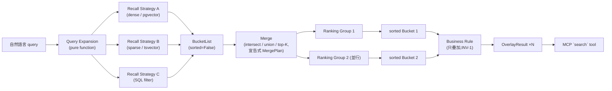

# Technical Design Document: Core Search Pipeline

| | |
|---|---|
| **Status** | Draft |
| **Version** | 0.1 |
| **Author** | architect(依 `.claude/agents/architect.md` 角色定義撰寫) |
| **Reviewers** | TBD |
| **Related spec** | [`docs/specs/search-framework-core-pipeline.md`](../specs/search-framework-core-pipeline.md) |
| **Related invariants** | CLAUDE.md §4 INV-1 ~ INV-5 |

## 1. Summary

在 PostgreSQL 之上,為多種異質文件型別(論文、投影片、機台手冊、table rows、先驗知識表)建立統一的五層檢索 pipeline(query expansion → recall → merge → ranking → business rule),並以單一 MCP `search` tool 對外暴露。本文件定義 `app/core/` 的資料模型、各層的介面契約(Protocol)、pipeline 組裝方式、MCP schema,以及每條不變式在型別層級的具體強制手段。實作(具體 recall/ranking/business 策略、真正的 SQL 查詢)不在本文件範圍內,交由 `retrieval-engineer` 依此契約實作。

## 2. Goals / Non-Goals

**Goals**

- 定義跨所有 data source 通用的 `DataPoint` / `Bucket` / `BucketList` 資料模型。
- 定義五層各自的介面(Protocol),使新增一個 recall 策略或 data source 不需修改其他層(INV-5)。
- 讓 INV-1(business rule 只疊加)、INV-2(recall 不精排)在**型別層級**就難以違反,而不只靠 code review 或人工檢查。
- 定義 MCP `search` tool 的 input/output schema 草案。
- 定義每條不變式對應的驗證手段(型別 or 測試),讓 code review 有明確 checklist。

**Non-Goals**

- 不決定實際用哪個 embedding model、哪個中文斷詞方案 —— 交給 retrieval-engineer。
- 不寫任何 recall/ranking/business 策略的具體演算法。
- 不含 API 認證、rate limiting、部署拓樸 —— 屬於另一份基礎設施文件,超出本文件範圍。
- 不含效能基準數字 —— 目前沒有真實資料量,列在 §9 開放問題。

## 3. Architecture Overview



每個 recall 策略、每個 ranking group、每條 business rule 都是**獨立注入**到 pipeline 的物件(見 §6 Pipeline Orchestration),不是寫死在 orchestrator 內部的分支邏輯 —— 這是 INV-5 在架構層級的具體實現方式。

## 4. Core Data Model(`app/core/types.py`)

所有型別用 pydantic v2、`frozen=True`。**選擇 immutable model + tuple(而非 list)不是風格偏好,是刻意的設計手段**:讓「business rule 層不可原地修改 ranking 輸出」這件事在型別系統層級就不可能發生(嘗試 mutate 會直接 raise,而不是等 code review 才發現)。

```python
from __future__ import annotations

from typing import Literal
from pydantic import BaseModel, Field, ConfigDict


class Provenance(BaseModel):
    """INV-3: 每個 DataPoint 的可追溯資訊,只能累加,不能重建。"""

    model_config = ConfigDict(frozen=True)

    source: str
    query_id: str
    recall_strategy: str
    stage_trace: tuple[str, ...] = Field(default_factory=tuple)

    def with_stage(self, stage: str) -> "Provenance":
        """回傳一個新的 Provenance,stage_trace 附加一筆。絕不原地修改。"""
        return self.model_copy(update={"stage_trace": (*self.stage_trace, stage)})


class DataPoint(BaseModel):
    """INV-4: 跨層傳遞的最小單位。source 專屬內容一律收斂在 payload。"""

    model_config = ConfigDict(frozen=True)

    id: str
    source: str
    payload: dict[str, object]
    score: float | None = None
    provenance: Provenance


class Bucket(BaseModel):
    """一組 DataPoint。sorted=False 是預設值,只有 ranking 層可以把它變 True(INV-2)。"""

    model_config = ConfigDict(frozen=True)

    bucket_id: str
    origin: str
    items: tuple[DataPoint, ...]
    sorted: bool = False


BucketList = tuple[Bucket, ...]


class QueryVariant(BaseModel):
    model_config = ConfigDict(frozen=True)

    query_id: str
    text: str
    intent: Literal["dense", "sparse", "filter", "generic"]
    weight: float = 1.0


class ExpandedQuery(BaseModel):
    model_config = ConfigDict(frozen=True)

    original_query: str
    variants: tuple[QueryVariant, ...]


class OverlayItem(BaseModel):
    """Business Rule 層疊加的單一項目。"""

    model_config = ConfigDict(frozen=True)

    content: Bucket | DataPoint
    placement: Literal["pin_top", "append_bucket", "inline_at"]
    reason: str


class OverlayResult(BaseModel):
    """INV-1 的型別化保證:base 與 overlays 分離,base 永遠等於 ranking 的原始輸出。"""

    model_config = ConfigDict(frozen=True)

    base: BucketList
    overlays: tuple[OverlayItem, ...]

    def restore_base(self) -> BucketList:
        """拿掉疊加內容,還原成 ranking 的原始輸出 —— 這是 INV-1 回歸測試直接呼叫的方法。"""
        return self.base
```

**欄位對照 spec 需求**:`DataPoint` 五欄位對應 spec 需求(id/source/payload/score/provenance);`Provenance.stage_trace` 對應需求 15;`QueryVariant.query_id` 對應需求 3;`Bucket.sorted` 對應需求 6/9/12;`OverlayResult` 對應需求 14。

## 5. Layer Interfaces(`app/core/interfaces.py`)

```python
from typing import Protocol


class QueryExpander(Protocol):
    def expand(self, query: str) -> ExpandedQuery:
        """純函數。不得存取任何 data source、不得有副作用。"""
        ...


class RecallStrategy(Protocol):
    name: str  # 寫入 Bucket.origin,例如 "dense_pgvector_papers"

    def recall(self, variants: tuple[QueryVariant, ...]) -> BucketList:
        """回傳的每個 Bucket.sorted 必須是 False。

        介面刻意不提供任何排序/精排相關參數 —— 這是 INV-2 在介面層級的強制:
        呼叫端沒有管道要求這個策略「順便排序」。
        """
        ...


class MergeOperator(Protocol):
    def apply(self, buckets: BucketList) -> BucketList:
        """對輸入 bucket 執行宣告式的集合運算(見 §5.1 MergePlan)。
        輸出 Bucket.sorted 必須維持 False。
        """
        ...


class RankingStrategy(Protocol):
    def rank(self, grouped_buckets: BucketList) -> Bucket:
        """把一組(由呼叫端決定分組)bucket 融合成單一個 sorted Bucket(sorted=True)。

        一次 pipeline 執行可以並行呼叫多個 RankingStrategy 實例、餵不同的分組,
        產生多個互相獨立的 sorted Bucket —— 分組邏輯不在這個介面內,由呼叫端
        (pipeline orchestrator)決定,見 §6。
        """
        ...


class BusinessRule(Protocol):
    def apply(self, ranked: BucketList) -> OverlayResult:
        """`ranked` 視為唯讀輸入,不得排序/刪除/修改既有項目 —— 只能疊加(INV-1)。

        因為 Bucket/DataPoint 都是 frozen model、BucketList 是 tuple,
        嘗試在實作內部「原地修改」在型別系統層級就會失敗,而不是留到測試才發現。
        """
        ...
```

### 5.1 MergePlan —— 宣告式 merge 規則

Merge 規則不得是寫死在 orchestrator 裡的命令式程式碼,必須是可序列化、可組合的描述:

```python
class MergePlan(BaseModel):
    model_config = ConfigDict(frozen=True)

    op: Literal["intersect", "union", "top_k"]
    inputs: tuple["MergePlan | str", ...]  # str = bucket_id 參照
    top_k: int | None = None       # op == "top_k" 時必填
    by: str = "score"              # top_k 的排序鍵,預設 score
```

範例(對應 spec 待確認事項:top-K 預設用 score,若未來要換排序鍵,只需改 `by` 值,不需改介面):

```python
plan = MergePlan(
    op="top_k",
    inputs=(
        MergePlan(
            op="intersect",
            inputs=(
                MergePlan(op="union", inputs=("dense_pgvector_papers", "sparse_fts_papers")),
                "sql_filter_metadata",
            ),
        ),
    ),
    top_k=50,
)
```

## 6. Pipeline Orchestration(`app/core/pipeline.py`)

```python
from collections.abc import Mapping, Sequence


class Pipeline:
    def __init__(
        self,
        expander: QueryExpander,
        recall_strategies: Sequence[RecallStrategy],
        merge_plan: MergePlan,
        ranking_groups: Mapping[str, RankingStrategy],  # group name -> strategy
        business_rules: Sequence[BusinessRule],
    ) -> None:
        self._expander = expander
        self._recall_strategies = tuple(recall_strategies)
        self._merge_plan = merge_plan
        self._ranking_groups = dict(ranking_groups)
        self._business_rules = tuple(business_rules)

    def run(self, query: str) -> tuple[OverlayResult, ...]:
        expanded = self._expander.expand(query)

        raw_buckets: BucketList = tuple(
            bucket
            for strategy in self._recall_strategies
            for bucket in strategy.recall(expanded.variants)
        )

        merged = execute_merge_plan(self._merge_plan, raw_buckets)

        ranked = tuple(
            strategy.rank(select_buckets(merged, group))
            for group, strategy in self._ranking_groups.items()
        )

        return tuple(rule.apply(ranked) for rule in self._business_rules)
```

**INV-5 在這裡怎麼被保證**:新增一個 `RecallStrategy` 只需要在建構 `Pipeline` 時多塞一個物件進 `recall_strategies`;`Pipeline.run()` 本身完全不知道有幾個策略、叫什麼名字。同理,新增一個 `BusinessRule` 只是多塞一個物件到 `business_rules`。orchestrator 程式碼裡**不應該出現任何 `if strategy.name == "..."` 這種針對特定策略的分支** —— 出現這種分支就是 INV-5 正在被破壞的訊號,code review 時要抓。

`select_buckets(merged, group)` 與 `execute_merge_plan(plan, buckets)` 為 helper function,對應§5.1 的 `MergePlan` 解讀邏輯,實作屬於 architect 範圍(骨架)+ retrieval-engineer 範圍(遞迴解讀 plan 樹的具體程式碼)。

## 7. MCP Interface(`app/mcp/`)

### 7.1 `search` tool schema(草案)

```json
{
  "name": "search",
  "description": "在論文、投影片、機台手冊、數值量測 table rows 與先驗知識表中,用自然語言查詢相關內容。適合當使用者想找語意相關的文件段落,或想用條件篩選結構化數據時呼叫。回傳依相關度排序的結果列表,可能包含業務規則額外插入的高優先權內容(以 overlay_reason 標示)。",
  "input_schema": {
    "type": "object",
    "properties": {
      "query": {
        "type": "string",
        "description": "自然語言查詢,支援中英文混合。"
      },
      "max_results": {
        "type": "integer",
        "default": 20,
        "minimum": 1,
        "maximum": 200
      },
      "filters": {
        "type": "object",
        "description": "可選的通用篩選條件。不得包含任何 source 專屬參數(例如向量資料庫的內部參數)。",
        "properties": {
          "source_types": { "type": "array", "items": { "type": "string" } },
          "date_range": {
            "type": "object",
            "properties": {
              "from": { "type": "string", "format": "date" },
              "to": { "type": "string", "format": "date" }
            }
          }
        }
      }
    },
    "required": ["query"]
  },
  "output_schema": {
    "type": "object",
    "properties": {
      "results": {
        "type": "array",
        "items": {
          "type": "object",
          "properties": {
            "id": { "type": "string" },
            "source": { "type": "string" },
            "score": { "type": "number" },
            "payload": { "type": "object" },
            "overlay_reason": {
              "type": ["string", "null"],
              "description": "非 null 表示這筆是業務規則疊加插入,而非純 ranking 結果。"
            }
          },
          "required": ["id", "source", "score", "payload"]
        }
      }
    }
  }
}
```

輸出刻意只回傳 `DataPoint` 的精簡投影(`id`/`source`/`score`/`payload`/`overlay_reason`),不暴露內部 `Bucket`/`BucketList`/完整 `provenance`(`stage_trace` 屬於內部除錯資訊,除錯用途另開一個 debug-only 欄位或走日誌,不混進對外 schema)。

## 8. Invariant Enforcement Matrix

| 不變式 | 型別層級保證 | 測試層級保證 |
|---|---|---|
| **INV-1** 業務規則只疊加 | `BusinessRule.apply` 回傳 `OverlayResult`(`base`/`overlays` 分離、皆 frozen);輸入 `ranked: BucketList` 是 tuple,無法原地修改 | `tests/unit/business/test_invariants.py::test_restorability` —— 跑過任意 business rule 後,`result.restore_base() == 原始 ranked` |
| **INV-2** recall 不精排 | `RecallStrategy.recall` / `MergeOperator.apply` 的回傳型別是 `BucketList`;`Bucket.sorted` 預設 `False`,`RecallStrategy`/`MergeOperator` 介面完全沒有排序相關參數 | `tests/unit/recall/test_invariants.py::test_bucket_never_marked_sorted` |
| **INV-3** provenance 保留 | `Provenance` frozen,只能透過 `with_stage()` 產生新實例並累加,沒有可以整個換掉 `stage_trace` 的 setter | `tests/integration/test_provenance_chain.py` —— 端到端追一個 DataPoint 經過四層後 `stage_trace` 長度與內容 |
| **INV-4** 跨層只用三型別 | 所有 Protocol 方法簽名只出現 `DataPoint`/`Bucket`/`BucketList`/`ExpandedQuery`/`OverlayResult`;沒有 `dict[str, Any]` 或 source 專屬型別逃逸出 `payload` | CI 開 `mypy --strict` 或 `pyright`;另加 `test_no_source_specific_type_leak` 靜態掃描介面簽名 |
| **INV-5** 新增策略不動其他層 | `Pipeline` 建構子以 `Sequence`/`Mapping` 注入策略,`run()` 內部不得有針對策略名稱的分支 | `tests/integration/test_extensibility.py::test_fake_source_does_not_break_other_layers` —— 加一個假 `RecallStrategy` 後,ranking/business/merge 既有測試全數維持通過 |

## 9. Non-Functional Requirements

- **Testability**:每個策略(`RecallStrategy`/`MergeOperator`/`RankingStrategy`/`BusinessRule`)必須無隱藏狀態,同樣輸入產生同樣輸出,可用固定 `Bucket`/`BucketList` fixture 單獨測試,不依賴其他層的行為。
- **Observability**:所有可觀測性靠 `Provenance.stage_trace`,不額外引入獨立的 tracing 系統(除非之後有明確需求) —— 這代表 `stage_trace` 的字串格式需要一致的命名慣例(例如 `"recall:dense_pgvector_papers"`、`"merge:top_k"`、`"ranking:rrf_group_a"`),由 architect 在下一版補一份命名規範。
- **Extensibility**(INV-5 的落地形式):新增 data source / recall 策略只需要(a)實作 `DataSource` adapter、(b)實作 `RecallStrategy`、(c)在建構 `Pipeline` 時多注入一個物件 —— 三步驟之外不應該有第四步「順便改某個既有檔案」。
- **Performance**:目前沒有真實資料量與 QPS 目標,無法訂 SLA。列為 §10 開放問題,建議 retrieval-engineer 在第一版 recall 策略上線後補一份效能基準(至少 p50/p95 延遲)。
- **並行性**:`recall_strategies` 之間互相獨立,理論上可以平行執行(每個策略各自查 Postgres);`ranking_groups` 之間也互相獨立,可平行。本文件不強制實作用 `asyncio` 或 thread pool,這是 retrieval-engineer 的實作選擇,但介面設計(§5)刻意不依賴任何共享可變狀態,所以平行化不會被介面本身擋住。

## 10. Testing & Evaluation Strategy

依 skill `retrieval-eval`:任何影響檢索行為的改動(recall 策略、ranking 策略、merge 規則)必須附 recall@k / precision@k / NDCG@k 前後對比數字,golden dataset 存 `tests/eval/golden/`。本文件定義的介面本身不含評測邏輯,由 `test-engineer` 在策略實作完成後補上。

單元測試對應層級:

- `tests/unit/expansion/` —— `QueryExpander` 純函數行為(不觸資料源)。
- `tests/unit/recall/` —— 各 `RecallStrategy`,含 INV-2 檢查。
- `tests/unit/merge/` —— `MergeOperator` / `MergePlan` 解讀邏輯。
- `tests/unit/ranking/` —— 各 `RankingStrategy`,含分組互相獨立性檢查。
- `tests/unit/business/` —— 各 `BusinessRule`,含 INV-1 restorability。
- `tests/integration/` —— 端到端 `Pipeline.run()`,含 INV-3、INV-5 回歸測試。
- `tests/eval/` —— recall@k / precision@k / NDCG@k。

## 11. Risks & Open Questions

延續 [`docs/specs/search-framework-core-pipeline.md`](../specs/search-framework-core-pipeline.md) 尚未確認的三點(PDF chunks 對應哪個既有 source、top-K 排序鍵是否就是 score、ranking 分組要不要對 MCP caller 動態暴露),另外本文件新增的實作層級風險:

- **`payload: dict[str, object]` 的型別精確度**:目前刻意寬鬆(不同 source 的 payload 形狀不同),但這代表下游用到 `payload` 內容時完全沒有型別檢查保護,容易寫出 `payload["title"]` 這種在某些 source 會 KeyError 的程式碼。建議每個 `DataSource` adapter 額外提供一個 `TypedDict` 或 per-source pydantic model 描述自己的 `payload` 形狀,供 `retrieval-engineer` 在該 source 專屬程式碼裡使用型別窄化(narrowing),但**不得**把這個窄化後的型別洩漏到跨層介面(仍維持 INV-4)。
- **`MergePlan` 遞迴解讀的效能**:巢狀 `MergePlan` 若很深,`execute_merge_plan` 遞迴解讀可能有效能疑慮;目前沒有資料量無法評估,先用簡單遞迴實作,若之後 profiling 顯示是瓶頸再優化。
- **`RankingStrategy` 的分組來源**:目前 `Pipeline.run()` 假設 `ranking_groups` 在建構時就固定;若 spec 待確認事項最終決定要讓 MCP caller 動態指定分組,`Pipeline` 介面需要調整成接受 runtime 參數 —— 這是一個潛在的破壞性變更,待該問題確認後再評估是否要現在就把介面設計得更彈性(例如 `run(query, ranking_group_overrides=...)`),避免之後才發現要大改。

## 12. Appendix: Glossary

見 skill `search-framework-spec` 與 CLAUDE.md §3,本文件不重複定義,僅在此列出交叉引用:`DataPoint`(§4)、`Bucket`/`BucketList`(§4)、`Provenance`(§4)、`ExpandedQuery`/`QueryVariant`(§4)、`MergePlan`(§5.1)、`OverlayResult`/`OverlayItem`(§4)。
